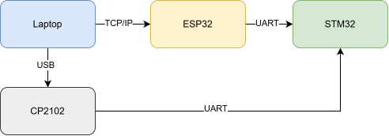
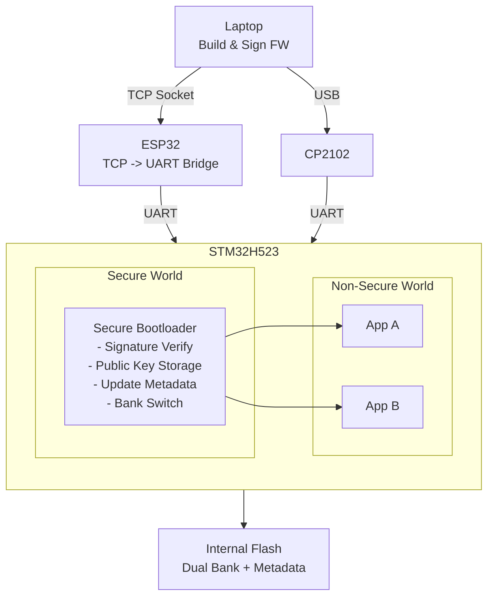

### System Context Diagram 

### System Architecture overview

```mermaid
flowchart TB

    Laptop[Laptop\nBuild & Sign FW]
    ESP[ESP32\nTCP -> UART Bridge]

    Laptop -->|TCP Socket| ESP
    ESP -->|UART| STM32
    CP2102 -->|UART|STM32
    Laptop -->|USB|CP2102

    subgraph STM32[STM32H523]

        subgraph Secure[Secure World]
            Boot[Secure Bootloader
            - Signature Verify
            - Public Key Storage
            - Update Metadata
            - Bank Switch]
        end

        subgraph NonSecure[Non-Secure World]
            AppA[App A\n]
            AppB[App B\n]
        end

        Boot --> AppA
        Boot --> AppB

    end

    STM32 --> Flash[Internal Flash\nDual Bank + Metadata]
```

### System Architecture internal

